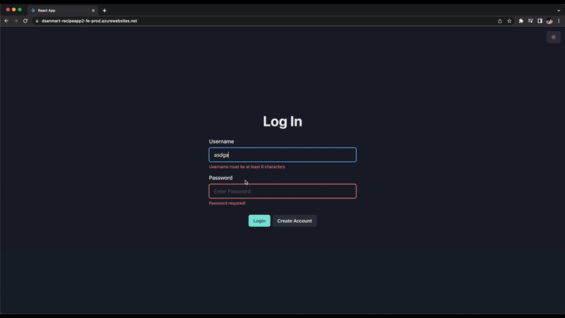

# User CRUD Recipe App

## Description

This is a React app repo that uses Infrastructure as Code and CICD for hosting it on 2 Azure web apps (one for the frontend and another one for the backend) using secrets.

The app is connected to a PostgreSQL database also hosted in Azure.

The app consists of a login/signup page that leads the user to a CRUD recipes page.

<br>

## Demo



<br>
<br>

# Instructions to run the App Locally

## Run frontend
```bash
cd frontend
npm install
npm start
```

## Run backend
```bash
cd backend
npm install
npm run dev
```

## Connect your postgres database
1. Create local `.env` file inside the `backend` folder with the following arguments:
```
DATABASE_NAME='dsanmart-recipeapp-db-prod'
DATABASE_HOST='your_db_host'
DATABASE_PORT='your_db_port'
DATABASE_USER='your_db_user'
DATABASE_PASSWORD='your_db_pass'
COOKIE_SECRET='anythingisvalidhere'
ENVIRONMENT='dev'
PORT=4000
```

2. Connect to your db
```bash
psql --host=your_db_host --port=your_db_port --username=your_db_user --dbname=dsanmart-recipeapp-db-prod --set=sslmode=require
```
```bash
\c dsanmart-recipeapp-db-prod
```

3. Create `user` and `recipe` tables in the db
```
CREATE TABLE users(
    id SERIAL PRIMARY KEY,
    username VARCHAR(28) NOT NULL UNIQUE,
    pass VARCHAR(28) NOT NULL,
    hashedpass VARCHAR NOT NULL
);

CREATE TABLE recipes(
    id SERIAL PRIMARY KEY,
    recipe_name VARCHAR(8000) NOT NULL,
    ingredients VARCHAR(8000) NOT NULL,
    steps VARCHAR(8000) NOT NULL,
    favorite BOOLEAN NOT NULL,
    rating INTEGER NOT NULL,
    user_id SERIAL,
    FOREIGN KEY (user_id) REFERENCES users(id)
);